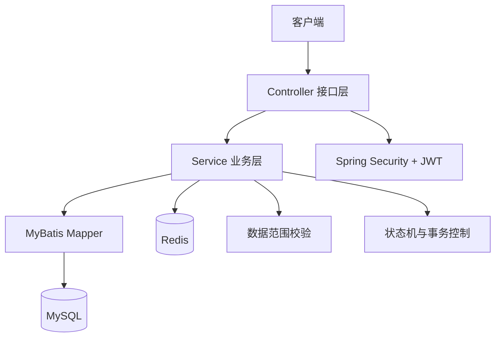

# 01-项目概述

## 1. 项目定位
本项目是“街道统筹、多社区、多小区、多物业协同”的社区服务平台后端，目标是交付可运行、可维护、可扩展的 Spring Boot 3 工程，而非演示型 Demo。

## 2. 当前实现范围（阶段1-5）
- 阶段1：项目骨架、统一返回体、统一异常、安全基础框架、OpenAPI。
- 阶段2：认证授权、用户角色权限、组织架构、数据范围控制、基础 SQL。
- 阶段3：公告与活动模块（含可见范围、活动报名并发控制）。
- 阶段4：报修工单全流程、状态机校验、流转日志与附件关联。
- 阶段5：登录日志与操作日志查询、测试与部署文档收尾、索引优化。

## 3. 技术栈
- JDK 17
- Spring Boot 3.x
- Spring Security + JWT
- Spring Validation
- MyBatis（XML Mapper）
- MySQL 8.x
- Redis
- SpringDoc OpenAPI + Knife4j

## 4. 模块划分
- `auth`：登录、登出、当前用户、改密。
- `system`：用户、角色、权限、角色授权与数据范围配置。
- `org`：组织树、组织管理、小区-物业服务关系。
- `notice`：公告管理、发布撤回、可见范围。
- `activity`：活动管理、发布撤回、报名/取消/统计。
- `repair`：报修工单创建、流转、确认、评价、催单。
- `log`：登录日志、操作日志记录与查询。

## 5. 组织与权限模型
- 组织模型：街道 -> 社区 -> 小区，物业公司与小区通过服务关系表关联。
- 权限模型：`RBAC + 数据范围` 双层控制。
- 数据范围：`ALL/STREET/COMMUNITY/COMPLEX/PROPERTY_COMPANY/CUSTOM/SELF`。

## 6. 总体架构图

## 7. 数据库策略
- 不使用外键约束，改为应用层事务 + 存在性校验 + 状态校验保证一致性。
- 统一逻辑删除与审计字段。
- 索引围绕高频查询场景设计，并在阶段5补充日志查询索引。

## 8. 非目标说明
- 本阶段不引入复杂工作流引擎。
- 本阶段不做对象存储（MinIO）正式接入，仅保留文件能力可扩展接口。
- 本阶段不做读写分离、分库分表，但预留演进空间。
