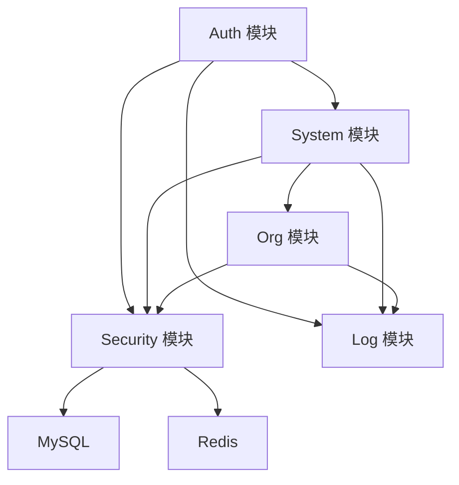

# 01 项目概述

## 1. 项目定位
本项目是一个基于 Spring Boot 3 的社区服务系统后端，服务对象覆盖街道、社区、小区、物业公司与居民用户。  
当前已完成阶段1-2能力：项目骨架、认证授权、组织管理、角色权限、数据范围、基础日志与数据库第一版。

## 2. 技术栈
- JDK 17（目标运行环境）
- Spring Boot 3.x
- Spring Web + Validation + Security
- MyBatis（XML Mapper）
- MySQL 8.x
- Redis
- SpringDoc OpenAPI + Knife4j

## 3. 核心特性（阶段1-2）
- JWT 无状态认证：登录、登出、获取当前用户、修改密码
- RBAC 权限控制：用户/角色/权限管理
- 数据范围控制：ALL/STREET/COMMUNITY/COMPLEX/PROPERTY_COMPANY/CUSTOM/SELF
- 组织架构管理：街道/社区/小区/物业公司/部门
- 小区与物业服务关系管理
- 登录日志 + 操作日志（AOP）

## 4. 模块总览图

## 5. 非目标（当前阶段）
- 公告、活动、报修完整业务流程（预留到后续阶段）
- 分布式部署与灰度发布（当前提供单体部署说明）

