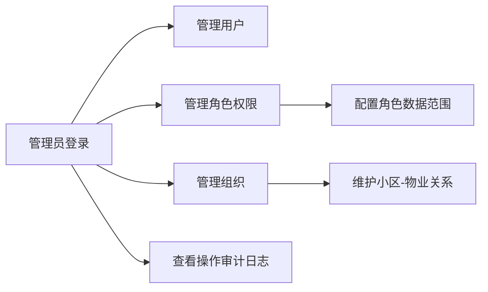

# 02 需求分析

## 1. 角色与用户类型
- 超级管理员
- 街道管理员
- 社区管理员
- 物业管理员
- 居民用户（后续阶段扩展更多居民业务）

## 2. 核心业务诉求（阶段1-2）
- 建立统一认证体系，支持 JWT 鉴权
- 建立用户、角色、权限、数据范围一体化管控
- 建立组织分层模型与小区-物业服务关系
- 提供可联调的 REST 接口与在线文档

## 3. 关键业务规则
- 用户仅可访问其权限允许的接口
- 管理类查询和写操作必须经过数据范围校验
- 非超级管理员不能下发超出自身权限与数据范围的角色配置
- 逻辑删除数据默认不参与业务查询
- 所有关键写操作记录操作日志，登录结果记录登录日志

## 4. 用例关系图

## 5. 当前验收边界
- 已覆盖：认证、授权、组织、数据范围、日志、SQL、基础文档
- 未覆盖：公告、活动、报修主流程与状态机（将在后续阶段补齐）

