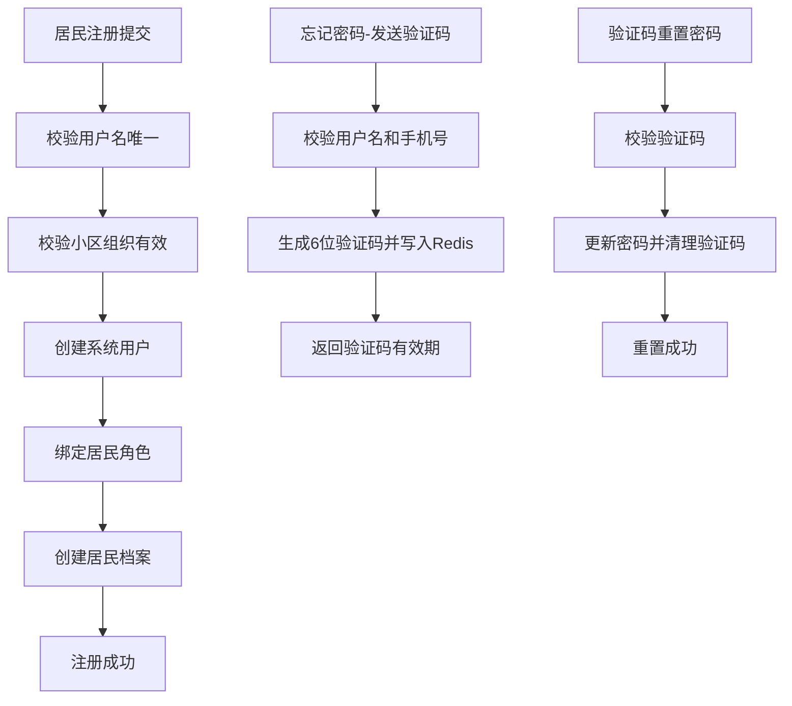
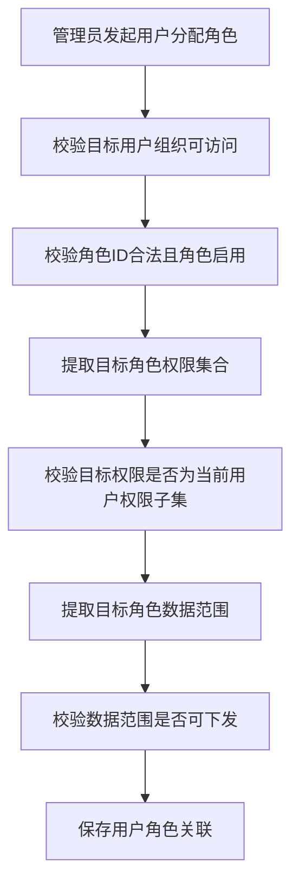

# 02-需求分析

## 1. 项目目标
构建街道-社区-小区-物业多方协同的社区服务后端，满足“可运行、可联调、可持续扩展”的工程要求。

## 2. 用户与角色
- 超级管理员：拥有全量权限与全量数据范围。
- 街道管理员：管理街道及下属社区/小区业务。
- 社区管理员：管理本社区及下属小区业务。
- 物业管理员：管理物业服务范围内业务。
- 居民用户：查看居民端公告/活动，发起与跟踪个人报修。

## 3. 业务痛点与关键诉求
- 认证侧：除登录外，还需支持居民自助注册、忘记密码找回。
- 授权侧：不仅要 RBAC，还要防止“角色权限越权下发”和“数据范围越权下发”。
- 组织侧：物业与小区是服务关系，不是简单树形父子关系。
- 流程侧：报修全链路必须合法流转、全程留痕、禁止越权操作。

## 4. 当前能力闭环（阶段1-5 + 本轮补强）
- 已实现：
- JWT 登录、登出、改密、当前用户信息。
- 居民注册、忘记密码发送验证码、验证码重置密码。
- 用户/角色/权限管理，用户角色分配，角色权限与数据范围配置。
- 用户分配角色新增越权校验，禁止下发超权限/超数据范围角色。
- 组织管理、小区-物业服务关系、公告、活动、报修、日志查询。

## 5. 核心规则
- 规则1：接口权限由权限码控制，未授权直接拦截。
- 规则2：管理类查询和写操作必须经过数据范围校验。
- 规则3：非超级管理员给角色赋权时，目标权限必须是自身权限子集。
- 规则4：非超级管理员给用户分配角色时，目标角色权限与数据范围不得越权。
- 规则5：逻辑删除数据默认过滤，不参与业务查询。
- 规则6：关键流程写操作记录操作日志，登录成功/失败记录登录日志。

## 6. 居民端认证流程

## 7. 后台账号角色分发流程

## 8. 全流程验收路径
- 路径1：居民注册 -> 登录 -> 居民活动报名 -> 发起报修 -> 确认/评价。
- 路径2：后台管理员创建账号 -> 分配角色 -> 配置权限和数据范围 -> 查询日志审计。
- 路径3：居民忘记密码 -> 验证码重置 -> 新密码登录。

## 9. 风险与约束
- 忘记密码验证码当前为一期联调模式（无短信网关，返回调试验证码）。
- 生产环境建议接入短信通道，并关闭返回验证码字段。
- 权限与数据范围依赖初始化 SQL，首次部署必须按顺序执行脚本。
