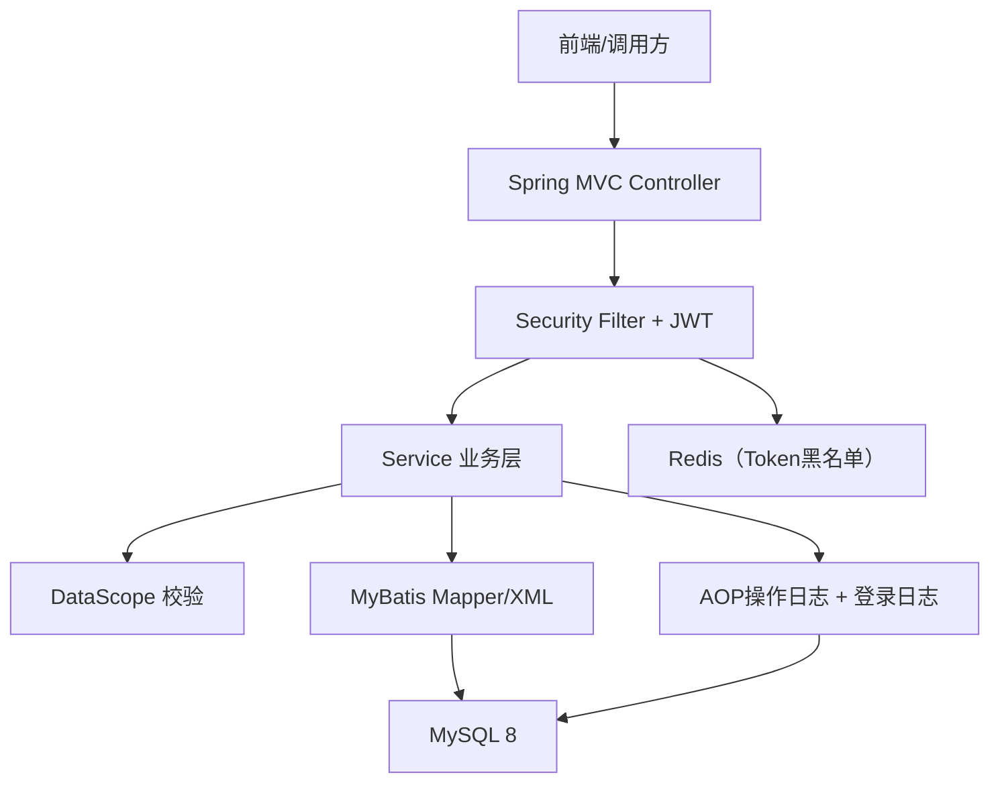
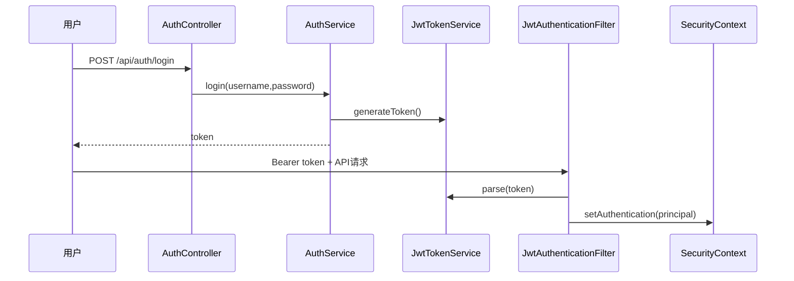

# 03 系统架构设计

## 1. 分层设计
- `controller`：接口编排、参数接收、返回统一响应
- `service`：业务规则与事务控制
- `mapper + XML`：持久层与复杂 SQL
- `security`：JWT 鉴权、权限拦截、登录上下文
- `common`：统一响应、异常、错误码、通用模型

## 2. 包结构
`xxqqyyy.community` 下按模块拆分：`auth/system/org/log/resident`，并以 `common/config/security/infrastructure` 承载横切能力。

## 3. 运行时架构

## 4. 安全链路

## 5. 一致性策略（无外键）
- 使用事务保证多表写入原子性（如：用户+角色、角色+权限+数据范围）
- 写入前执行存在性校验和越权校验
- 查询时统一过滤 `deleted = 0`
- 通过日志表保留关键行为审计链路

