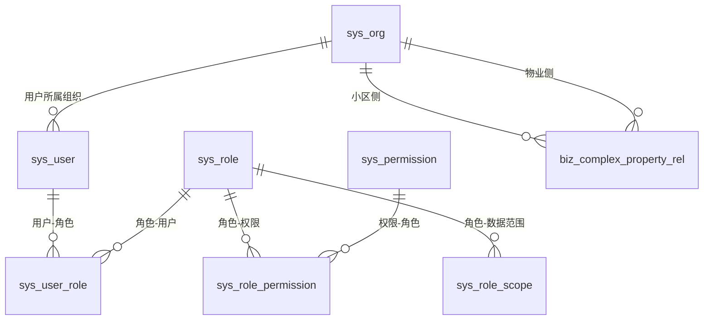

# 04 数据库设计

## 1. 设计原则
- MySQL 8.x + InnoDB + utf8mb4
- 所有表和字段均包含中文语义注释
- 不使用外键约束，改由应用层控制一致性
- 统一审计字段：`create_by/create_time/update_by/update_time/deleted/version`

## 2. 核心表清单（阶段1-2）
- 系统权限：`sys_user/sys_role/sys_permission/sys_user_role/sys_role_permission/sys_role_scope`
- 组织模型：`sys_org`
- 字典：`sys_dict_type/sys_dict_data`
- 业务关联：`biz_complex_property_rel/biz_resident_profile/biz_file_info`
- 存储配置：`sys_storage_config`（本地/七牛切换）
- 审计日志：`log_login/log_operation`

## 3. 逻辑关系图（无外键）

## 4. 为什么不使用外键
- 组织与权限模型演进频繁，跨模块上线时外键耦合会增加迁移风险。
- 通过服务层事务可以在业务边界上更精准地控制一致性与回滚策略。
- 通过预校验 + 唯一索引 + 逻辑删除过滤，保证逻辑完整性与查询稳定性。

## 5. 一致性保障手段
- 写入前校验：目标用户、角色、组织、权限必须存在且未删除。
- 越权校验：数据范围必须覆盖目标组织，否则拒绝写入。
- 事务控制：角色与权限、角色与数据范围、用户与角色均采用事务提交。
- 审计追踪：关键动作写 `log_operation`，登录写 `log_login`。
