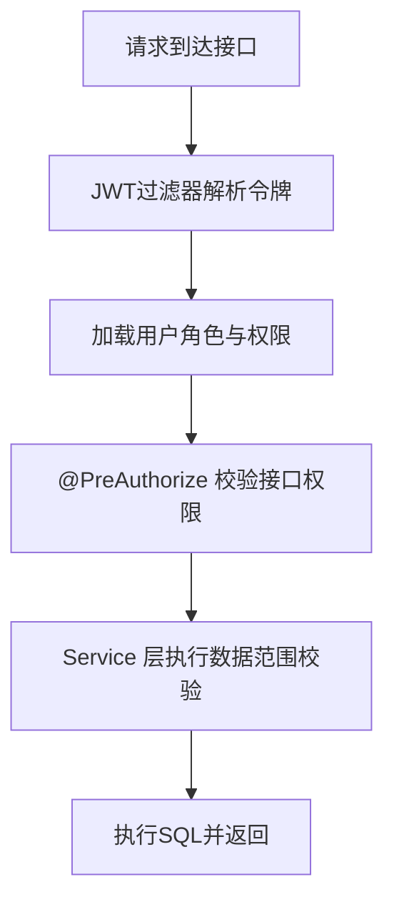

# 05 权限与数据范围设计

## 1. 模型说明
系统采用 `RBAC + 数据范围` 双层控制：
- 第一层：接口级权限（`permission_code`）
- 第二层：数据级权限（`sys_role_scope` + 组织树）

## 2. 鉴权流程

## 3. 数据范围类型
- `ALL`：全部数据（仅建议超级管理员）
- `STREET`：街道范围
- `COMMUNITY`：社区范围
- `COMPLEX`：小区范围
- `PROPERTY_COMPANY`：物业公司范围
- `CUSTOM`：自定义组织范围
- `SELF`：仅本人数据

## 4. 越权拦截策略
- 非超级管理员不可下发 `ALL` 范围。
- 角色授权时，目标权限必须是创建者权限子集。
- 角色范围配置时，`scope_ref_id` 必须位于创建者可访问组织集合内。
- 用户/组织管理接口在写操作前统一调用 `DataScopeService` 做断言校验。

## 5. 关键约束
- 组织可见集通过组织祖先路径展开子树。
- 权限集通过 `用户->角色->权限` 动态聚合。
- 管理接口统一在 Service 中进行权限边界二次校验（防止仅靠 Controller 注解）。

