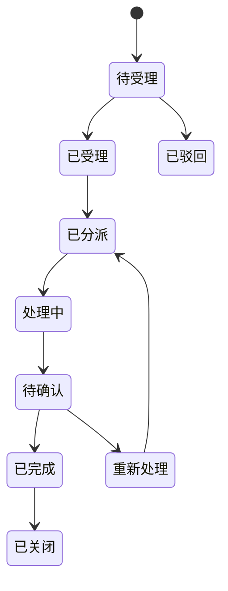

# 07 报修流程设计（预研版）

> 说明：本文件在阶段2先提供流程与状态设计，阶段4补充完整接口与实现细节。

## 1. 流程节点
1. 居民发起报修
2. 物业受理
3. 分派维修员
4. 维修员接单与处理
5. 居民确认
6. 关闭或重新处理

## 2. 状态流转图

## 3. 核心约束
- 非法状态跳转必须拦截并记录日志。
- 物业与维修人员仅可处理其可见范围内工单。
- 每次状态变更都必须写入流转日志。
- 关键流程必须使用事务，避免部分更新。

