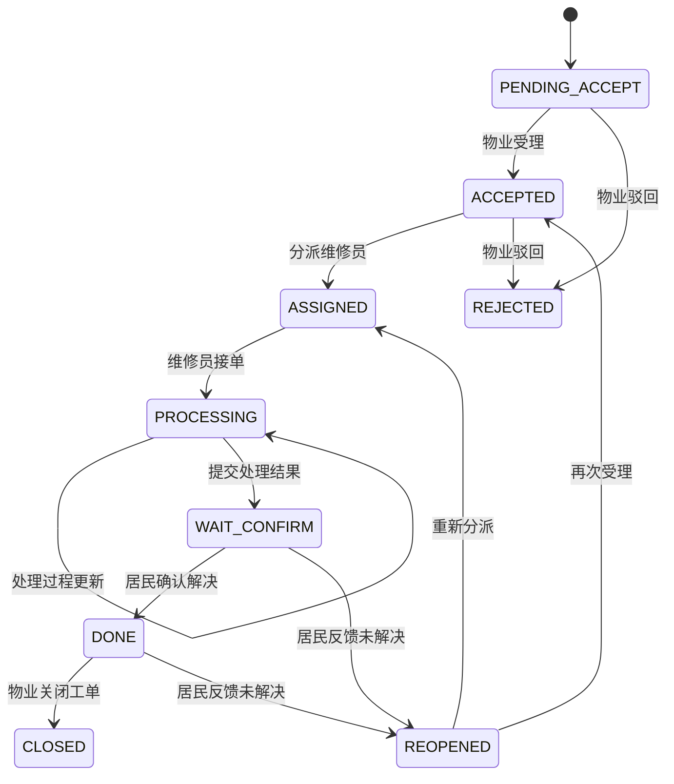

# 07-报修流程设计

## 1. 目标
- 实现居民、物业客服、维修员三方协作的报修闭环。
- 严格校验状态流转合法性，禁止跳步骤和跨范围操作。
- 每次关键动作写入流转日志，保证全流程可追溯。

## 2. 核心状态机

## 3. 角色职责
- 居民：
- 创建报修、查看我的工单、催单、确认解决、反馈未解决、评价。
- 物业客服/管理员：
- 工单列表与详情、受理、驳回、分派、关闭。
- 维修员：
- 接单、处理过程记录、提交处理结果。

## 4. 合法性校验规则
- 状态流转校验：通过 `RepairStateMachine` 统一控制。
- 身份校验：
- 居民相关操作必须满足 `residentUserId == 当前登录用户ID`。
- 维修员操作必须满足 `maintainerUserId == 当前登录用户ID`。
- 数据范围校验：
- 物业管理操作需满足当前用户对工单 `complexOrgId` 有可见权限。
- 组织关联校验：
- 创建报修时校验小区必须存在且组织类型为 `COMPLEX`。
- 创建报修时校验小区与物业公司存在有效服务关系。

## 5. 流转日志设计
- 表：`biz_repair_order_log`
- 关键字段：
- `repair_order_id`
- `from_status`
- `to_status`
- `operation_type`
- `operator_user_id`
- `operation_remark`
- `operation_time`
- 每次关键动作都写日志，不允许“静默”改状态。

## 6. 附件策略
- 表：`biz_repair_attachment`
- 附件类型：
- `REPORT`：居民报修附件
- `PROCESS`：处理过程附件
- `RESULT`：处理结果附件
- `FEEDBACK`：未解决反馈附件

## 7. 事务边界
- 以下操作均使用事务：
- 创建工单（主表 + 附件 + 流转日志）
- 受理/驳回/分派/接单/处理/提交结果
- 居民确认/重开/评价/催单
- 关闭工单

## 8. 异常场景处理
- 非法状态流转：返回 `ILLEGAL_STATE_FLOW`。
- 越权操作：返回 `FORBIDDEN` 或 `DATA_SCOPE_DENIED`。
- 目标工单不存在：返回 `NOT_FOUND`。
- 维修员不存在或禁用：返回 `BAD_REQUEST`。
