# 01-管理端信息架构与路由权限设计

## 1. 文档目标
- 将现有后端能力沉淀为可直接开工的管理端前端信息架构。
- 固化菜单、路由、权限码、按钮级权限矩阵，避免前后端对齐偏差。
- 覆盖角色视角：超级管理员、街道管理员、社区管理员、物业管理员、维修员。

## 2. 设计约束
- 前端技术栈：`Vue3 + Vite + TypeScript + Pinia + Element Plus`。
- 后端接口不改动，全部以 `back/community/src/main/java/...Controller` 现有接口为准。
- 统一权限模型：页面访问权限 + 按钮操作权限，均使用后端 `permission_code`。
- 统一返回结构：`ApiResponse<T>`，HTTP 状态默认 `200`，业务成败由 `code` 决定。

## 3. 管理端菜单树

```mermaid
graph TD
    A["管理端"] --> B["认证与账号"]
    A --> C["公告管理"]
    A --> D["活动管理"]
    A --> E["报修工单"]
    A --> F["系统管理"]
    A --> G["组织管理"]
    A --> H["日志审计"]
    A --> I["存储配置"]

    B --> B1["登录页"]
    B --> B2["修改密码"]
    B --> B3["忘记密码(运营排障页)"]

    C --> C1["公告列表"]
    C --> C2["公告新建/编辑"]
    C --> C3["公告详情(含 Markdown 预览)"]

    D --> D1["活动列表"]
    D --> D2["活动新建/编辑"]
    D --> D3["活动详情(含 Markdown 预览)"]
    D --> D4["报名名单/统计"]

    E --> E1["工单管理列表"]
    E --> E2["工单详情与状态流转"]
    E --> E3["工单流转日志"]

    F --> F1["用户管理"]
    F --> F2["角色管理"]
    F --> F3["权限管理"]

    G --> G1["组织树管理"]
    G --> G2["小区-物业关联管理"]

    H --> H1["登录日志"]
    H --> H2["操作日志"]

    I --> I1["文件存储配置(LOCAL/QINIU)"]
```

## 4. 路由结构与页面访问权限
> 约定：`route.meta.permissions` 表示进入页面所需权限集合，集合内任一命中即可放行（通常配置为单权限）。

| 一级菜单 | 路由 | 页面标识 | 页面准入权限 | 备注 |
|---|---|---|---|---|
| 认证与账号 | `/login` | `auth-login` | 无 | 公开页 |
| 认证与账号 | `/profile/password` | `profile-password` | 已登录 | 调用 `/api/auth/password` |
| 公告管理 | `/notice/list` | `notice-list` | `notice:list` | 列表页 |
| 公告管理 | `/notice/create` | `notice-create` | `notice:create` | 新建页 |
| 公告管理 | `/notice/edit/:id` | `notice-edit` | `notice:update` | 编辑页 |
| 公告管理 | `/notice/detail/:id` | `notice-detail` | `notice:view` | 详情页 |
| 活动管理 | `/activity/list` | `activity-list` | `activity:list` | 列表页 |
| 活动管理 | `/activity/create` | `activity-create` | `activity:create` | 新建页 |
| 活动管理 | `/activity/edit/:id` | `activity-edit` | `activity:update` | 编辑页 |
| 活动管理 | `/activity/detail/:id` | `activity-detail` | `activity:view` | 详情页 |
| 活动管理 | `/activity/signups/:id` | `activity-signups` | `activity:signup:list` | 报名名单 |
| 报修工单 | `/repair/manage` | `repair-manage` | `repair:manage:list` | 管理分页 |
| 报修工单 | `/repair/detail/:id` | `repair-detail` | `repair:manage:view` | 工单详情 |
| 报修工单 | `/repair/logs/:id` | `repair-logs` | `repair:log:view` | 流转日志 |
| 系统管理 | `/system/users` | `system-users` | `sys:user:list` | 用户管理 |
| 系统管理 | `/system/roles` | `system-roles` | `sys:role:list` | 角色管理 |
| 系统管理 | `/system/permissions` | `system-permissions` | `sys:permission:list` | 权限管理 |
| 组织管理 | `/org/tree` | `org-tree` | `org:tree:view` | 树与组织编辑 |
| 组织管理 | `/org/complex-property` | `org-complex-property` | `org:complex-property:list` | 关联关系维护 |
| 日志审计 | `/logs/login` | `logs-login` | `log:login:list` | 登录日志 |
| 日志审计 | `/logs/operation` | `logs-operation` | `log:operation:list` | 操作日志 |
| 存储配置 | `/system/storage` | `system-storage` | `sys:storage:view` | 仅超级管理员显示“保存配置” |

## 5. 页面层级与面包屑规则
- 一级页面面包屑格式：`首页 / 一级菜单名称`。
- 二级详情页面：`首页 / 一级菜单名称 / 页面标题`，页面标题由业务字段驱动。
- 新建页标题统一使用“新建xx”，编辑页统一使用“编辑xx”，详情页统一使用“xx详情”。
- 从列表进入详情后返回，保留原查询条件、分页参数、排序状态。

## 6. 按钮级权限矩阵
| 页面 | 按钮/操作 | 权限码 | 对应接口 |
|---|---|---|---|
| 公告列表 | 查询 | `notice:list` | `GET /api/notices` |
| 公告列表 | 新建 | `notice:create` | `POST /api/notices` |
| 公告列表 | 编辑 | `notice:update` | `PUT /api/notices` |
| 公告列表 | 删除 | `notice:delete` | `DELETE /api/notices/{id}` |
| 公告列表 | 发布 | `notice:publish` | `POST /api/notices/{id}/publish` |
| 公告列表 | 撤回 | `notice:recall` | `POST /api/notices/{id}/recall` |
| 活动列表 | 查询 | `activity:list` | `GET /api/activities` |
| 活动列表 | 新建 | `activity:create` | `POST /api/activities` |
| 活动列表 | 编辑 | `activity:update` | `PUT /api/activities` |
| 活动列表 | 删除 | `activity:delete` | `DELETE /api/activities/{id}` |
| 活动列表 | 发布 | `activity:publish` | `POST /api/activities/{id}/publish` |
| 活动列表 | 撤回 | `activity:recall` | `POST /api/activities/{id}/recall` |
| 活动详情 | 报名名单 | `activity:signup:list` | `GET /api/activities/{id}/signups` |
| 活动详情 | 报名统计 | `activity:stats` | `GET /api/activities/{id}/stats` |
| 报修管理 | 查询列表 | `repair:manage:list` | `GET /api/repairs/manage` |
| 报修详情 | 受理 | `repair:accept` | `POST /api/repairs/{id}/accept` |
| 报修详情 | 驳回 | `repair:reject` | `POST /api/repairs/{id}/reject` |
| 报修详情 | 分派 | `repair:assign` | `POST /api/repairs/{id}/assign` |
| 报修详情 | 接单 | `repair:take` | `POST /api/repairs/{id}/take` |
| 报修详情 | 处理 | `repair:process` | `POST /api/repairs/{id}/process` |
| 报修详情 | 提交结果 | `repair:submit` | `POST /api/repairs/{id}/submit` |
| 报修详情 | 关闭工单 | `repair:close` | `POST /api/repairs/{id}/close` |
| 报修详情 | 查看日志 | `repair:log:view` | `GET /api/repairs/{id}/logs` |
| 用户管理 | 查询 | `sys:user:list` | `GET /api/system/users` |
| 用户管理 | 新增 | `sys:user:create` | `POST /api/system/users` |
| 用户管理 | 编辑 | `sys:user:update` | `PUT /api/system/users` |
| 用户管理 | 状态切换 | `sys:user:update` | `PUT /api/system/users/{id}/status` |
| 用户管理 | 删除 | `sys:user:delete` | `DELETE /api/system/users/{id}` |
| 用户管理 | 分配角色 | `sys:user:assign-role` | `PUT /api/system/users/roles` |
| 角色管理 | 查询 | `sys:role:list` | `GET /api/system/roles` |
| 角色管理 | 新增 | `sys:role:create` | `POST /api/system/roles` |
| 角色管理 | 编辑 | `sys:role:update` | `PUT /api/system/roles` |
| 角色管理 | 删除 | `sys:role:delete` | `DELETE /api/system/roles/{id}` |
| 权限管理 | 查询 | `sys:permission:list` | `GET /api/system/permissions` |
| 权限管理 | 新增 | `sys:permission:create` | `POST /api/system/permissions` |
| 权限管理 | 编辑 | `sys:permission:update` | `PUT /api/system/permissions` |
| 权限管理 | 删除 | `sys:permission:delete` | `DELETE /api/system/permissions/{id}` |
| 组织树 | 查询 | `org:tree:view` | `GET /api/org/tree` |
| 组织树 | 新增 | `org:create` | `POST /api/org` |
| 组织树 | 编辑 | `org:update` | `PUT /api/org` |
| 组织树 | 删除 | `org:delete` | `DELETE /api/org/{id}` |
| 小区物业关联 | 查询 | `org:complex-property:list` | `GET /api/org/complex-property-rel` |
| 小区物业关联 | 新增 | `org:complex-property:create` | `POST /api/org/complex-property-rel` |
| 小区物业关联 | 删除 | `org:complex-property:delete` | `DELETE /api/org/complex-property-rel/{id}` |
| 登录日志 | 查询 | `log:login:list` | `GET /api/logs/logins` |
| 操作日志 | 查询 | `log:operation:list` | `GET /api/logs/operations` |
| 文件上传组件 | 上传 | `file:upload` | `POST /api/files/upload` |
| 文件上传组件 | 查看/下载 | `file:view` | `GET /api/files/{id}`、`GET /api/files/{id}/download` |
| 存储配置 | 查看配置 | `sys:storage:view` | `GET /api/system/storage-config` |
| 存储配置 | 保存配置 | `sys:storage:update` | `PUT /api/system/storage-config` |

## 7. 角色视角可见性矩阵
| 菜单/能力 | 超级管理员 | 街道管理员 | 社区管理员 | 物业管理员 | 维修员 |
|---|---|---|---|---|---|
| 公告管理 | 全量 | 可见（受数据范围限制） | 可见（受数据范围限制） | 可见（受数据范围限制） | 默认不配置 |
| 活动管理 | 全量 | 可见（受数据范围限制） | 可见（受数据范围限制） | 可见（受数据范围限制） | 默认不配置 |
| 报修工单管理 | 全量 | 可见 | 可见 | 可见 | 仅工单处理动作页 |
| 用户管理 | 全量 | 可见 | 部分可见 | 部分可见 | 默认不配置 |
| 角色管理 | 全量 | 可见（子级约束） | 可见（子级约束） | 可见（子级约束） | 默认不配置 |
| 权限管理 | 全量 | 通常只读 | 通常只读 | 通常只读 | 默认不配置 |
| 组织管理 | 全量 | 可见（街道范围） | 可见（社区范围） | 仅关联视图 | 默认不配置 |
| 日志审计 | 全量 | 可见 | 可见 | 可见 | 默认不配置 |
| 存储配置 | 全量 | 不可见 | 不可见 | 不可见 | 不可见 |

## 8. 居民端后续边界（本阶段仅预留）
- 居民端将在下一阶段单独设计，不并入当前管理端菜单。
- 仅预留路由命名规则：`/resident/*`。
- 预留页面：居民公告、居民活动、我的报修、报修详情、评价反馈、个人资料。
