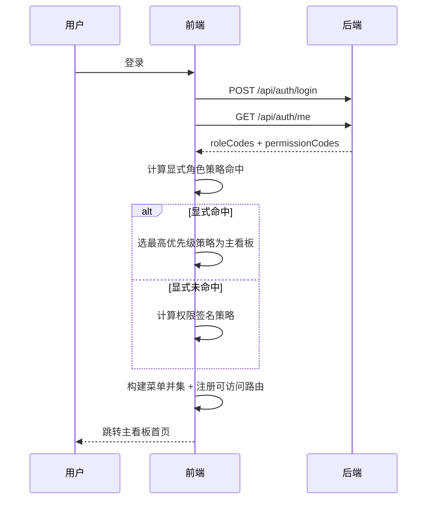
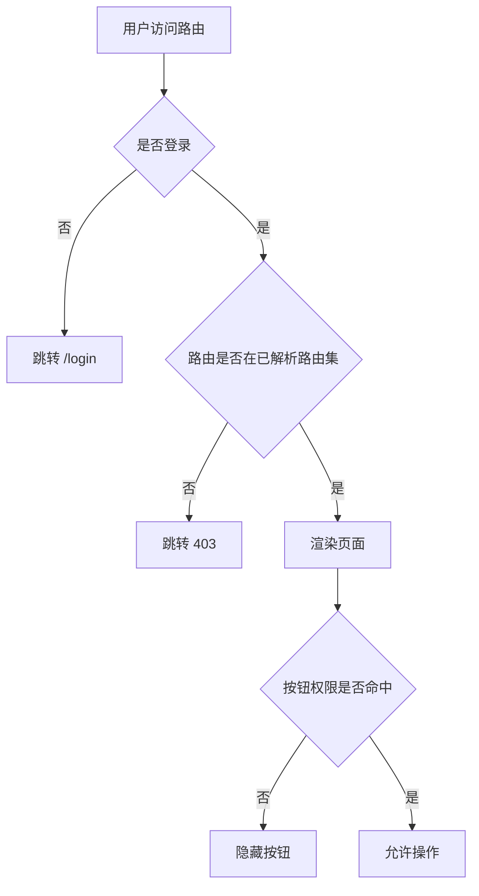

# 05-角色页面包与看板策略

## 1. 设计目标
- 实现“同一后台，不同部门角色看到不同页面”。
- 在角色可动态扩展前提下，避免前端硬编码固定角色名导致不可维护。
- 明确多角色用户冲突处理规则，确保首页唯一、菜单稳定、权限可追踪。

## 2. 核心策略总览
- 页面访问控制采用“路由+菜单隔离”，不是仅按钮隐藏。
- 登录成功后以 `/api/auth/me` 的 `roleCodes + permissionCodes` 作为导航解析输入。
- 导航解析顺序固定：
  1. 显式角色策略（roleCode 直接命中）
  2. 权限签名策略（permissionCodes 规则命中）
  3. 默认策略（最小可用导航）
- 菜单与路由基于权限并集生成；按钮仍按权限码单独控制。
- 深链访问统一二次鉴权，未命中页面包直接 403。

## 3. 类型契约（前端策略层）
```ts
export interface RolePagePolicy {
  policyId: string
  priority: number
  roleMatcher?: {
    includeRoleCodes?: string[]
    excludeRoleCodes?: string[]
  }
  permissionMatcher?: {
    allOf?: string[]
    anyOf?: string[]
    noneOf?: string[]
  }
  pagePackCode: string
  dashboardCode: string
}

export interface DashboardPolicy {
  dashboardCode: string
  title: string
  routePath: string
  cardKeys: string[]
  quickEntryRouteNames: string[]
  requiredPermissions: string[]
}

export interface ResolvedNavigation {
  pagePackCode: string
  dashboardCode: string
  defaultHomeRoute: string
  menuTree: MenuNode[]
  routeNames: string[]
  deniedRouteNames: string[]
}
```

## 4. 页面包定义表（Role Page Pack）

### 4.1 页面包与路由归属
| 页面包编码 | 面向角色 | 主看板路由 | 主要菜单 | 禁止出现的菜单 |
|---|---|---|---|---|
| `PACK_SUPER_ADMIN` | 超级管理员 | `/dashboard/super-admin` | 系统管理、组织管理、公告、活动、报修、日志、存储配置 | 无 |
| `PACK_STREET_ADMIN` | 街道管理员 | `/dashboard/street-admin` | 公告、活动、报修、组织、日志、用户（限定） | 存储配置、权限管理写操作 |
| `PACK_COMMUNITY_ADMIN` | 社区管理员 | `/dashboard/community-admin` | 公告、活动、报修、组织（社区范围）、日志 | 存储配置、权限管理、跨街道组织维护 |
| `PACK_PROPERTY_ADMIN` | 物业管理员 | `/dashboard/property-admin` | 报修、公告、活动、组织关联、用户（物业范围） | 存储配置、权限管理、街道级组织编辑 |
| `PACK_MAINTAINER` | 维修员 | `/dashboard/maintainer` | 报修工单、工单日志 | 系统管理、组织管理、公告管理、活动管理、日志审计、存储配置 |
| `PACK_FALLBACK` | 动态扩展角色兜底 | `/dashboard/general` | 按权限计算的最小菜单集 | 无权限页面 |

### 4.2 页面包命中规则（显式角色策略）
| 优先级 | 命中角色码 | 页面包 | 看板 |
|---|---|---|---|
| 100 | `SUPER_ADMIN` | `PACK_SUPER_ADMIN` | `DASH_SUPER_ADMIN` |
| 90 | `STREET_ADMIN` | `PACK_STREET_ADMIN` | `DASH_STREET_ADMIN` |
| 80 | `COMMUNITY_ADMIN` | `PACK_COMMUNITY_ADMIN` | `DASH_COMMUNITY_ADMIN` |
| 70 | `PROPERTY_ADMIN` | `PACK_PROPERTY_ADMIN` | `DASH_PROPERTY_ADMIN` |
| 60 | `MAINTAINER` | `PACK_MAINTAINER` | `DASH_MAINTAINER` |

## 5. 权限签名策略（动态角色扩展）
> 当角色码不在显式策略内时，走权限签名自动归类。

| 签名编码 | 命中条件（示例） | 映射页面包 | 说明 |
|---|---|---|---|
| `SIGN_SUPER` | 包含 `sys:storage:update` 或同时包含 `sys:role:create + sys:permission:create` | `PACK_SUPER_ADMIN` | 具备平台治理能力 |
| `SIGN_STREET` | 包含 `notice:create + activity:create + org:tree:view`，且不含 `sys:storage:update` | `PACK_STREET_ADMIN` | 街道治理能力 |
| `SIGN_COMMUNITY` | 包含 `notice:create + activity:create + repair:manage:list` | `PACK_COMMUNITY_ADMIN` | 社区运营能力 |
| `SIGN_PROPERTY` | 包含 `repair:assign + repair:accept` | `PACK_PROPERTY_ADMIN` | 物业调度能力 |
| `SIGN_MAINTAINER` | 包含 `repair:take + repair:process + repair:submit` | `PACK_MAINTAINER` | 维修执行能力 |
| `SIGN_FALLBACK` | 以上均不命中 | `PACK_FALLBACK` | 最小导航兜底 |

## 6. 看板策略表（Dashboard Policy）
| 看板编码 | 角色 | 默认路由 | 核心卡片 | 快捷入口 |
|---|---|---|---|---|
| `DASH_SUPER_ADMIN` | 超级管理员 | `/dashboard/super-admin` | 用户总数、角色总数、公告发布数、活动发布数、工单总量 | 用户管理、角色管理、组织树、存储配置 |
| `DASH_STREET_ADMIN` | 街道管理员 | `/dashboard/street-admin` | 街道公告数、街道活动数、待处理工单数、社区覆盖数 | 公告列表、活动列表、报修管理、组织树 |
| `DASH_COMMUNITY_ADMIN` | 社区管理员 | `/dashboard/community-admin` | 社区公告数、社区活动报名数、待受理工单、已完结工单 | 公告列表、活动列表、报修管理 |
| `DASH_PROPERTY_ADMIN` | 物业管理员 | `/dashboard/property-admin` | 待分派工单、处理中工单、超时工单、满意度 | 报修管理、工单详情、公告列表 |
| `DASH_MAINTAINER` | 维修员 | `/dashboard/maintainer` | 我的待接单、我的处理中、今日完成、催单提醒 | 我的工单、工单处理、工单日志 |
| `DASH_GENERAL` | 动态兜底角色 | `/dashboard/general` | 可访问模块数、最近操作 | 首个可访问菜单 |

## 7. 多角色冲突处理规则
- 主看板只允许一个，按“策略优先级最高者”确定。
- 菜单与路由按全部角色权限并集计算。
- 按钮级操作继续按权限码判定，不跟随主看板。
- 若用户主看板对应路由失效（权限更新后），自动回退到“首个可访问菜单路由”。

### 7.1 冲突处理时序图


## 8. 深链访问二次鉴权
- 任意非登录路由进入前执行：
  1. 判断是否在 `ResolvedNavigation.routeNames` 内。
  2. 若不在，返回 403 页面并记录访问日志。
  3. 若在，继续检查按钮权限与数据范围。

### 8.1 深链鉴权流程图


## 9. 各后台角色独立页面清单
> 以下清单用于前端路由注册与菜单渲染，字段口径：路由、菜单、默认首页、主要按钮、不可见页面。

### 9.1 超级管理员
- 默认首页：`/dashboard/super-admin`
- 可见菜单：系统管理、组织管理、公告、活动、报修、日志、存储配置
- 关键按钮：全量（以权限码为准）
- 不可见页面：无

### 9.2 街道管理员
- 默认首页：`/dashboard/street-admin`
- 可见菜单：公告、活动、报修、组织、日志、用户管理（受权限限制）
- 关键按钮：`notice:*`、`activity:*`、`repair:manage:*`、`org:*`（按权限）
- 不可见页面：存储配置、高危系统治理页

### 9.3 社区管理员
- 默认首页：`/dashboard/community-admin`
- 可见菜单：公告、活动、报修、组织（社区范围）
- 关键按钮：公告发布撤回、活动发布撤回、报修受理分派（按权限）
- 不可见页面：存储配置、权限管理、跨街道组织页

### 9.4 物业管理员
- 默认首页：`/dashboard/property-admin`
- 可见菜单：报修、公告、活动、组织关联
- 关键按钮：`repair:accept/reject/assign/close`、公告活动业务按钮
- 不可见页面：系统级用户角色治理页、存储配置

### 9.5 维修员
- 默认首页：`/dashboard/maintainer`
- 可见菜单：报修工单、流转日志
- 关键按钮：`repair:take/process/submit`
- 不可见页面：系统管理、组织管理、公告活动管理、日志审计、存储配置

## 10. 落地约束与回归要求
- 本策略文档不要求后端新增接口，直接消费 `/api/auth/me`。
- 新角色接入时优先新增策略配置，不修改业务页面代码。
- 回归必须覆盖：
  - 五类角色菜单与路由不同；
  - 看板独立且首页正确；
  - 深链越权 403；
  - 多角色用户首页唯一；
  - 公告/活动/报修主链路不受策略变更影响。
